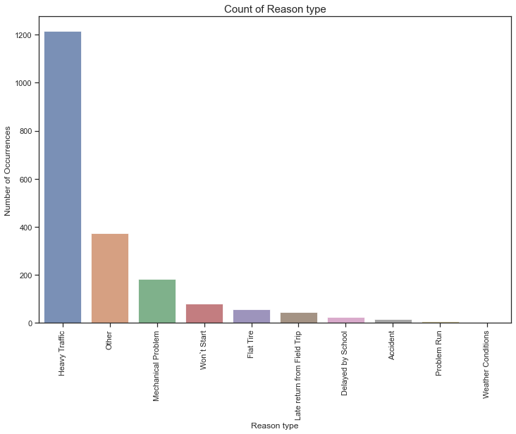
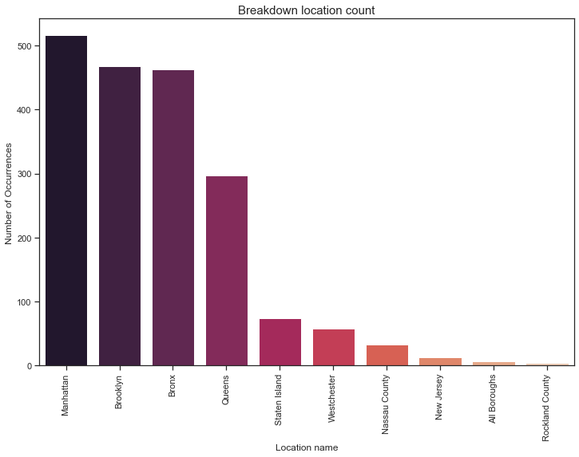

# Visualization of New York City School Bus Breakdown and Delays Data

**Team: Dharshan Karthick Shanmugam, Jaganathan Nagaraj, Bijay Surya Mandava and Sangavi Selvanarayanan Padmavathy**


# Introduction
*The data is pulled from NYC Open Data. It consists of records for Bus Breakdown and Delay system information from school bus vendors operating out in the field in real time. The key factors used in this data visualization are the reasons for the breakdown/delay, Bus Company Name, Number of students on the bus, county or state in which the delay occurred, Delay Notified or not.*


# Sources
•	*The source code came from NYC Open Data
•	The code retrieves data from API source 
•	The link to create a account in Socrata 
•	The code to create  plots using Seaborn Package*


# Explanation of the Code
*The code begins by importing necessary Python packages:
•	import seaborn as sns
•	import matplotlib.pyplot as plt
•	import datetime
•	import calendar
•	import pandas as pd
•	from sodapy import Socrata*


```python
import seaborn as sns
import matplotlib.pyplot as plt
import datetime
import calendar
```

•	*Note:The following packages need to be installed:
•	pip install seaborn
•	pip install sodapy
•	pip install pandas*


*We then import data from NYC Open Data using User Credentials and API Token by calling API .The following code extracts the data from its source using the API key by requesting the data from the host and reading their response. We then store the incoming data in a variable, read it, and then decode it so it can be used. In the following code, the data pulled using API is converted to a pandas data frame* 


```python
import pandas as pd
from sodapy import Socrata

# Unauthenticated client only works with public data sets. Note 'None'
# in place of application token, and no username or password:
client = Socrata("data.cityofnewyork.us", None)

# Example authenticated client (needed for non-public datasets):
# client = Socrata(data.cityofnewyork.us,
#                  MyAppToken,
#                  userame="user@example.com",
#                  password="AFakePassword")

# First 2000 results, returned as JSON from API / converted to Python list of
# dictionaries by sodapy.
results = client.get("ez4e-fazm", limit=2000)

df = pd.DataFrame.from_records(results)
df
```

    WARNING:root:Requests made without an app_token will be subject to strict throttling limits.
    


<div>
<style scoped>
    .dataframe tbody tr th:only-of-type {
        vertical-align: middle;
    }

    .dataframe tbody tr th {
        vertical-align: top;
    }

    .dataframe thead th {
        text-align: right;
    }
</style>
<table border="1" class="dataframe">
  <thead>
    <tr style="text-align: right;">
      <th></th>
      <th>school_year</th>
      <th>busbreakdown_id</th>
      <th>run_type</th>
      <th>bus_no</th>
      <th>route_number</th>
      <th>reason</th>
      <th>schools_serviced</th>
      <th>occurred_on</th>
      <th>created_on</th>
      <th>boro</th>
      <th>...</th>
      <th>number_of_students_on_the_bus</th>
      <th>has_contractor_notified_schools</th>
      <th>has_contractor_notified_parents</th>
      <th>have_you_alerted_opt</th>
      <th>informed_on</th>
      <th>last_updated_on</th>
      <th>breakdown_or_running_late</th>
      <th>school_age_or_prek</th>
      <th>how_long_delayed</th>
      <th>incident_number</th>
    </tr>
  </thead>
  <tbody>
    <tr>
      <th>0</th>
      <td>2015-2016</td>
      <td>1227538</td>
      <td>Special Ed AM Run</td>
      <td>2621</td>
      <td>J711</td>
      <td>Heavy Traffic</td>
      <td>75003</td>
      <td>2015-11-05T08:10:00.000</td>
      <td>2015-11-05T08:12:00.000</td>
      <td>New Jersey</td>
      <td>...</td>
      <td>11</td>
      <td>Yes</td>
      <td>No</td>
      <td>Yes</td>
      <td>2015-11-05T08:12:00.000</td>
      <td>2015-11-05T08:12:14.000</td>
      <td>Running Late</td>
      <td>School-Age</td>
      <td>NaN</td>
      <td>NaN</td>
    </tr>
    <tr>
      <th>1</th>
      <td>2015-2016</td>
      <td>1227539</td>
      <td>Special Ed AM Run</td>
      <td>1260</td>
      <td>M351</td>
      <td>Heavy Traffic</td>
      <td>06716</td>
      <td>2015-11-05T08:10:00.000</td>
      <td>2015-11-05T08:12:00.000</td>
      <td>Manhattan</td>
      <td>...</td>
      <td>2</td>
      <td>Yes</td>
      <td>Yes</td>
      <td>No</td>
      <td>2015-11-05T08:12:00.000</td>
      <td>2015-11-05T08:13:34.000</td>
      <td>Running Late</td>
      <td>School-Age</td>
      <td>20MNS</td>
      <td>NaN</td>
    </tr>
    <tr>
      <th>2</th>
      <td>2015-2016</td>
      <td>1227540</td>
      <td>Pre-K/EI</td>
      <td>418</td>
      <td>3</td>
      <td>Heavy Traffic</td>
      <td>C445</td>
      <td>2015-11-05T08:09:00.000</td>
      <td>2015-11-05T08:13:00.000</td>
      <td>Bronx</td>
      <td>...</td>
      <td>8</td>
      <td>Yes</td>
      <td>Yes</td>
      <td>Yes</td>
      <td>2015-11-05T08:13:00.000</td>
      <td>2015-11-05T08:13:22.000</td>
      <td>Running Late</td>
      <td>Pre-K</td>
      <td>15MIN</td>
      <td>NaN</td>
    </tr>
    <tr>
      <th>3</th>
      <td>2015-2016</td>
      <td>1227541</td>
      <td>Special Ed AM Run</td>
      <td>4522</td>
      <td>M271</td>
      <td>Heavy Traffic</td>
      <td>02699</td>
      <td>2015-11-05T08:12:00.000</td>
      <td>2015-11-05T08:14:00.000</td>
      <td>Manhattan</td>
      <td>...</td>
      <td>6</td>
      <td>No</td>
      <td>No</td>
      <td>No</td>
      <td>2015-11-05T08:14:00.000</td>
      <td>2015-11-05T08:14:04.000</td>
      <td>Running Late</td>
      <td>School-Age</td>
      <td>15 MIN</td>
      <td>NaN</td>
    </tr>
    <tr>
      <th>4</th>
      <td>2015-2016</td>
      <td>1227542</td>
      <td>Special Ed AM Run</td>
      <td>3124</td>
      <td>M373</td>
      <td>Heavy Traffic</td>
      <td>02116</td>
      <td>2015-11-05T08:13:00.000</td>
      <td>2015-11-05T08:14:00.000</td>
      <td>Manhattan</td>
      <td>...</td>
      <td>6</td>
      <td>No</td>
      <td>No</td>
      <td>No</td>
      <td>2015-11-05T08:14:00.000</td>
      <td>2015-11-05T08:14:08.000</td>
      <td>Running Late</td>
      <td>School-Age</td>
      <td>NaN</td>
      <td>NaN</td>
    </tr>
    <tr>
      <th>...</th>
      <td>...</td>
      <td>...</td>
      <td>...</td>
      <td>...</td>
      <td>...</td>
      <td>...</td>
      <td>...</td>
      <td>...</td>
      <td>...</td>
      <td>...</td>
      <td>...</td>
      <td>...</td>
      <td>...</td>
      <td>...</td>
      <td>...</td>
      <td>...</td>
      <td>...</td>
      <td>...</td>
      <td>...</td>
      <td>...</td>
      <td>...</td>
    </tr>
    <tr>
      <th>1995</th>
      <td>2015-2016</td>
      <td>1231034</td>
      <td>Special Ed AM Run</td>
      <td>GC0048</td>
      <td>X647</td>
      <td>Heavy Traffic</td>
      <td>08131</td>
      <td>2015-11-20T07:37:00.000</td>
      <td>2015-11-20T07:39:00.000</td>
      <td>Bronx</td>
      <td>...</td>
      <td>3</td>
      <td>Yes</td>
      <td>No</td>
      <td>No</td>
      <td>2015-11-20T07:39:00.000</td>
      <td>2015-11-20T07:39:01.000</td>
      <td>Running Late</td>
      <td>School-Age</td>
      <td>10 mins</td>
      <td>NaN</td>
    </tr>
    <tr>
      <th>1996</th>
      <td>2015-2016</td>
      <td>1231036</td>
      <td>Special Ed AM Run</td>
      <td>2432</td>
      <td>M288</td>
      <td>Mechanical Problem</td>
      <td>02183</td>
      <td>2015-11-20T07:36:00.000</td>
      <td>2015-11-20T07:39:00.000</td>
      <td>Manhattan</td>
      <td>...</td>
      <td>2</td>
      <td>No</td>
      <td>Yes</td>
      <td>Yes</td>
      <td>2015-11-20T07:39:00.000</td>
      <td>2015-11-20T07:39:21.000</td>
      <td>Breakdown</td>
      <td>School-Age</td>
      <td>NaN</td>
      <td>NaN</td>
    </tr>
    <tr>
      <th>1997</th>
      <td>2015-2016</td>
      <td>1231037</td>
      <td>Special Ed AM Run</td>
      <td>4137</td>
      <td>Q175</td>
      <td>Problem Run</td>
      <td>24422</td>
      <td>2015-11-20T07:38:00.000</td>
      <td>2015-11-20T07:40:00.000</td>
      <td>Queens</td>
      <td>...</td>
      <td>22</td>
      <td>Yes</td>
      <td>Yes</td>
      <td>No</td>
      <td>2015-11-20T07:40:00.000</td>
      <td>2015-11-20T07:59:55.000</td>
      <td>Running Late</td>
      <td>School-Age</td>
      <td>30 MINS</td>
      <td>NaN</td>
    </tr>
    <tr>
      <th>1998</th>
      <td>2015-2016</td>
      <td>1231043</td>
      <td>Special Ed AM Run</td>
      <td>9925</td>
      <td>L359</td>
      <td>Heavy Traffic</td>
      <td>17862</td>
      <td>2015-11-20T07:40:00.000</td>
      <td>2015-11-20T07:42:00.000</td>
      <td>Bronx</td>
      <td>...</td>
      <td>7</td>
      <td>Yes</td>
      <td>Yes</td>
      <td>Yes</td>
      <td>2015-11-20T07:42:00.000</td>
      <td>2015-11-20T07:42:32.000</td>
      <td>Running Late</td>
      <td>School-Age</td>
      <td>NaN</td>
      <td>NaN</td>
    </tr>
    <tr>
      <th>1999</th>
      <td>2015-2016</td>
      <td>1231044</td>
      <td>Pre-K/EI</td>
      <td>703</td>
      <td>3</td>
      <td>Heavy Traffic</td>
      <td>C459</td>
      <td>2015-11-20T07:42:00.000</td>
      <td>2015-11-20T07:42:00.000</td>
      <td>Bronx</td>
      <td>...</td>
      <td>6</td>
      <td>Yes</td>
      <td>Yes</td>
      <td>No</td>
      <td>2015-11-20T07:42:00.000</td>
      <td>2015-11-20T07:42:48.000</td>
      <td>Running Late</td>
      <td>Pre-K</td>
      <td>20 MINS</td>
      <td>NaN</td>
    </tr>
  </tbody>
</table>
<p>2000 rows × 21 columns</p>
</div>


# Data Visualization:
*The data extracted in the previous steps are used to visualize it for the first part of visualization, the below charts shows the different reasons reported by the driver, how much time each reasons are reported and the number of breakdown/delay occurred in different cities. From the graph it’s clear that most of the time the reason for delay is heavy traffic and Manhattan is the city with higher count for delay/breakdown of the bus. The following code visualises the plot:*


```python
color = sns.color_palette()
reason = df['reason'].value_counts()
plt.figure(figsize=(12,8))
sns.barplot(reason.index, reason.values, alpha=0.8,  palette="deep")
plt.ylabel('Number of Occurrences', fontsize=12)
plt.xlabel('Reason type', fontsize=12)
plt.title('Count of Reason type', fontsize=15)
plt.xticks(rotation='vertical')
plt.show()

color = sns.color_palette()
loc = df['boro'].value_counts()
plt.figure(figsize=(12,8))
sns.barplot(x=loc.index, y= loc.values, palette="rocket")
plt.ylabel('Number of Occurrences', fontsize=12)
plt.xlabel('Location name', fontsize=12)
plt.title('Breakdown location count', fontsize=15)
plt.xticks(rotation='vertical')
plt.show()
plt.tight_layout()
```

    C:\Users\Jagan\anaconda3\lib\site-packages\seaborn\_decorators.py:36: FutureWarning: Pass the following variables as keyword args: x, y. From version 0.12, the only valid positional argument will be `data`, and passing other arguments without an explicit keyword will result in an error or misinterpretation.
      warnings.warn(
    


    

    


    

    


    <Figure size 432x288 with 0 Axes>


*The second part of visualization shows us the different bus companies and the number of breakdowns/delays for each company and it’s clear that the two companies LEESEL and RELIANT TRANS INC have the majority of breakdowns/delays. The following code visualises the Pie chart:*


```python
#Using matplotlib
c=df["bus_company_name"].value_counts()
c=c.head(10)
pie, ax = plt.subplots(figsize=[10,6])
labels = c.keys()
plt.pie(x=c, autopct="%.1f%%", explode=[0.05]*10, labels=labels, pctdistance=0.5)
plt.title(" Bus Company name", fontsize=14)
```


    Text(0.5, 1.0, ' Bus Company name')


    

    


*The third part of visualisation shows the number of running late/breakdown buses in different cities and the number of Pre-K, school age students travelling by bus in different locations during a breakdown/running late. As evident from the plot, the busses running late due to traffic seems to be higher in all the cities and also the school age students travelling by bus are higher in all cities compared to the pre-k students. The following code visualises the plot:*


```python
sns.set_theme(style="ticks")
i = sns.catplot(data=df,kind='count',x='boro',hue='school_age_or_prek', height=5,aspect=3)
plt.ylabel('Number of Occurrences', fontsize=12)
plt.xlabel('Location name', fontsize=12)
plt.title('Count of Pre-k and School-age students by location', fontsize=15)
ax = i.facet_axis(0,0)
for p in ax.patches:
    ax.text(p.get_x() , 
            p.get_height(), 
            '{0:.2f}'.format(p.get_height()), 
            color='black', rotation='horizontal', size='large')

sns.set_theme(style="ticks")
j = sns.catplot(data=df,kind='count',x='breakdown_or_running_late',hue='boro', height=6,aspect=3)
plt.ylabel('Number of Occurrences', fontsize=12)
plt.xlabel('Location name', fontsize=12)
plt.title('Breakdown/ Running late by location', fontsize=15)
ax = j.facet_axis(0,0)
for p in ax.patches:
    ax.text(p.get_x() + 0.015, 
            p.get_height() * 1.02, 
            '{0:.2f}'.format(p.get_height()), 
            color='black', rotation='horizontal', size='large')
```

    WARNING:matplotlib.text:posx and posy should be finite values
    WARNING:matplotlib.text:posx and posy should be finite values
    WARNING:matplotlib.text:posx and posy should be finite values
    WARNING:matplotlib.text:posx and posy should be finite values
    WARNING:matplotlib.text:posx and posy should be finite values
    WARNING:matplotlib.text:posx and posy should be finite values
    WARNING:matplotlib.text:posx and posy should be finite values
    WARNING:matplotlib.text:posx and posy should be finite values
    WARNING:matplotlib.text:posx and posy should be finite values
    WARNING:matplotlib.text:posx and posy should be finite values
    WARNING:matplotlib.text:posx and posy should be finite values
    WARNING:matplotlib.text:posx and posy should be finite values
    WARNING:matplotlib.text:posx and posy should be finite values
    WARNING:matplotlib.text:posx and posy should be finite values
    


    

    


    WARNING:matplotlib.text:posx and posy should be finite values
    WARNING:matplotlib.text:posx and posy should be finite values
    WARNING:matplotlib.text:posx and posy should be finite values
    WARNING:matplotlib.text:posx and posy should be finite values
    WARNING:matplotlib.text:posx and posy should be finite values
    WARNING:matplotlib.text:posx and posy should be finite values
    WARNING:matplotlib.text:posx and posy should be finite values
    WARNING:matplotlib.text:posx and posy should be finite values
    WARNING:matplotlib.text:posx and posy should be finite values
    WARNING:matplotlib.text:posx and posy should be finite values
    


    

    


*This part of visualisation shows whether the breakdown/delay of the bus is reported to the school and the parents. The following code visualises the plot:*


```python
sns.set_theme(style="ticks")
g = sns.catplot(data=df,kind='count',x='boro',hue='has_contractor_notified_parents', height=6,aspect=3)
plt.ylabel('Number of Occurrences', fontsize=12)
plt.xlabel('Location name', fontsize=12)
plt.title('Notification to parents by location', fontsize=15)
ax = g.facet_axis(0,0)
for p in ax.patches:
    ax.text(p.get_x() + 0.015, 
            p.get_height() * 1.02, 
            '{0:.2f}'.format(p.get_height()), 
            color='black', rotation='horizontal', size='large')

sns.set_theme(style="ticks")
h = sns.catplot(data=df,kind='count',x='boro',hue='has_contractor_notified_schools', height=6,aspect=3)
plt.ylabel('Number of Occurrences', fontsize=12)
plt.xlabel('Location name', fontsize=12)
plt.title('Notification to schools by location', fontsize=15)
ax = h.facet_axis(0,0)
for p in ax.patches:
    ax.text(p.get_x() + 0.015, 
            p.get_height() * 1.02, 
            '{0:.2f}'.format(p.get_height()), 
            color='black', rotation='horizontal', size='large')
```

    WARNING:matplotlib.text:posx and posy should be finite values
    WARNING:matplotlib.text:posx and posy should be finite values
    


    

    


    WARNING:matplotlib.text:posx and posy should be finite values
    WARNING:matplotlib.text:posx and posy should be finite values
    WARNING:matplotlib.text:posx and posy should be finite values
    WARNING:matplotlib.text:posx and posy should be finite values
    


    

    


```python

```


```python

```
